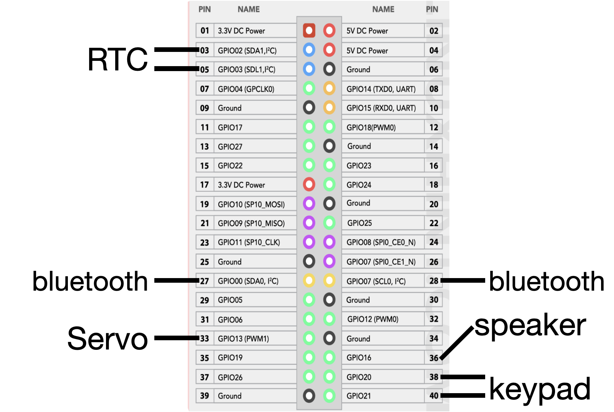
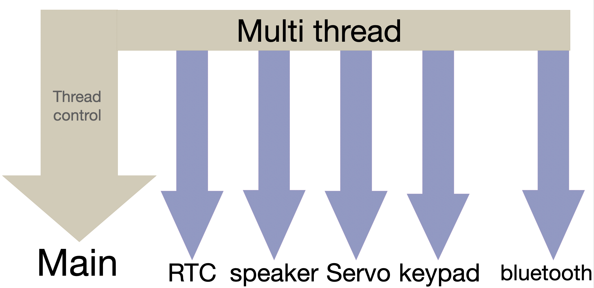
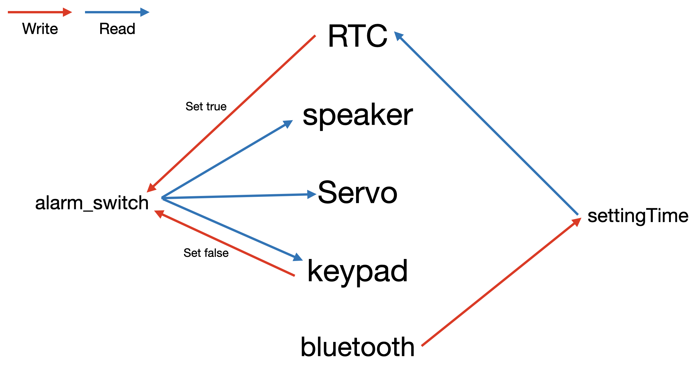

# Embedded system TermProject
## 센서를 활용한 알람 시계 제작

금오공과대학교 컴퓨터공학과 
임베디드시스템 1분반 - 5팀 
신상호 20180630 
이인재 20180894 
이재형 20180904 
이정우 20190893 

## 목차
1. 프로젝트 개요
2. 초안
3. 1차 구현
4. 최종 구현
5. 실행 화면
6. 미해결 문제점들
7. 향후 개발 방향

### 1. 프로젝트 개요
**센서 및 액추에이터를 활용한 알람 시계 제작** 
기본적인 알람 기능 외에 부가적인 기능도 추가한 다기능 알람시계를 목표로 제작하였습니다. 
모터를 이용하여 전등을 키고, 알람 종료 조건을 귀찮게 만듬으로써 사용자가 잠에서 깨지 않고는 못배기게 만든 알람시계입니다. 

기능 목록
- 알람 기능
- 특정 조건을 만족해야만 알람이 꺼지는 기능
- 자동으로 전등의 on/off 조절

### 2. 초안
기능 목록
- 조도 센서와 RTC 모듈을 사용하여 알람 타이밍 결정
- 패시브 스피커를 통해 알람 출력
- FND 상의 숫자를 넘버 패드로 입력하면 알람 종료
- 서보 모터를 사용하여 전등 스위치를 물리적으로 제어
- DC 모터를 이용하여 커튼 걷기

사용 센서 or 액추에이터 목록
- PWM : 패시브 스피커, DC 모터, 서보 모터
- I2C : RTC, 조도 센서, 숫자 키 패드
- GPIO : FND

프로그램 흐름 
main 함수 실행 후, 조도 센서와 RTC 모듈의 동작을 백그라운드 프로세스로 실행시킨다. 
이후, 이 백그라운드 프로세스들은 메인 프로세스와 IPC로 데이터를 주고받으며 알람 시간 설정 및 알람 시작을 결정한다. 
알람이 울리기 시작하면, 각 모듈의 동작들을 쓰레드를 통해 동시다발적으로 실행한다. 

### 3. 1차 구현
설계 변경 사항
- 숫자 키 패드 및 스피커의 구동 방식 변경 - GPIO를 통한 구동
- PWM모듈 간 충돌 발생. 우선순위에서 밀리는 모듈 제거 - DC 모터
- 사용 목적이 불분명한 센서 제거 - 조도 센서
- 교수님의 피드백을 받아 통신 모듈 추가 - 블루투스 모듈

1차 구현 시 사용한 모듈
- PWM : 서보 모터
- I2C : RTC
- GPIO : FND, 패시브 스피커, 숫자 키 패드
    *각 모듈 별 독립적인 동작만 구현
- UART : 블루투스

프로그램 흐름 변경 
백그라운드 프로세스 -> 전부 쓰레드로 대체 
블루투스 쓰레드에서 알람 시간 설정 
mutex의 lock을 이용하여 알람 시간 설정 시 임계구역 문제 방지 
메인 쓰레드에서 설정한 시간이 되면 알람 구동 

데모 영상 
<video src="%E1%84%83%E1%85%A9%E1%86%BC%E1%84%8C%E1%85%A1%E1%86%A8%E1%84%8B%E1%85%A7%E1%86%BC%E1%84%89%E1%85%A1%E1%86%BC.MP4" controls title="Title"></video>

### 4. 최종 구현
설계 변경 사항
- FND 제외(독립적인 동작은 되나 병합 시 I2C버스 오류 발생)
- 숫자 키 패드 기능 병합

사용 모듈
1. 서보 모터 (PWM) : 전등 스위치의 물리적 on/off
2. RTC (I2C) : 시간 측정 모듈
3. 패시브 스피커 : 알람 시각에 알람음 출력
4. 숫자 키 패드 : 알람 종료를 위해 4자리 숫자를 받는 입력장치
5. 블루투스 (UART) : 스마트폰과 블루투스를 통해 알람 시각 입력

회로도 

GPIO 핀 상세 
스피커 - GPIO 16 
서보 모터 - GPIO 13 (PWM 1) 
숫자 키 패드 - SCL = GPIO 21, SDA = GPIO 20 
bluetooth - TXD = GPIO 1, RXD = GPIO 0 (UART) 
RTC - SDA = GPIO 2, SDL = GPIO 3 (I2C) 

프로그램 흐름도 
각 모듈마다 하나의 쓰레드 할당.  
메인 쓰레드는 쓰레드 컨트롤만 담당. 

각 모듈 별 임계구역 접근도 
해당 프로그램에는 교착상태를 일으키는 변수가 총 2개 존재한다. 
이를 2개의 mutex 변수를 통해 보호하였다. 
다음은 접근하는 모듈들을 도식화하여 낸 것이다. 

### 5. 실행 화면
기본적으로는 데모 영상과 동작이 똑같다. 다만 프로그램 무한유지, 예외처리 등의 리팩토링을 통해 최적화를 진행한 상태이다. 
=>!!키패드 동작 화면 누락됨!! 그러나 최종 데모 시연 시간에 잘 작동함을 검증하였음. 

FND의 병합에 오류가 있어서 부득이하게 프로그램 콘솔 화면에 정보 출력.
처음 실행 시, 현재 시각과 알람 예정 시각을 출력한다.
그 후 하단에 초기값이 주어진 핀 번호와 현재 입력 번호가 출력된다.

스마트폰에서 블루투스를 통해 알람 시각을 지정할 수 있다.

알람 시각이 되면 알람이 울리게 되고(데모 영상 참조) 하단에 핀 번호가 나오게 된다.

다음 화면처럼 핀 번호에 맞는 번호를 숫자 키 패드 모듈을 통해 입력하면 알람이 멈추게 된다.

알림이 멈추더라도 시계는 계속 돌아가고, 다음 날 같은 시각에 또다시 알람이 울리게 된다.

### 6. 미해결 문제점들
1. FND와 최종본 회로 결합 시 I2C버스의 고장 
    이에 대한 증상들 
    i2cdetect -y -1 명령어의 동작이 아주 느려짐. 또한 i2c번호 감지 X 
    i2cdetect 시 i2c버스를 감지하지 못함. 
2. PWM 충돌 문제 
    pwm0, pwm1의 핀에 DC모터 연결 후, 서보 모터를 softpwm으로 연결하였으나, 두 모듈 다 동작하지 않았음. 상대적으로 중요도가 떨어지는 DC모터를 배제함으로써 해결. 

### 7. 향후 개발 방향
1. 다수의 알람 설정 기능 추가
2. 어플리케이션과의 연동으로 간편하게 알람 시간 지정
3. 특정 시간에 자동으로 전등을 소등시키는 나이트 모드 기능 추가
4. 현재 콘솔에 출력되는 정보들을 모두 임베디드 모듈에서 출력 - FND 해결 or CLCD 등의 대안 찾기
