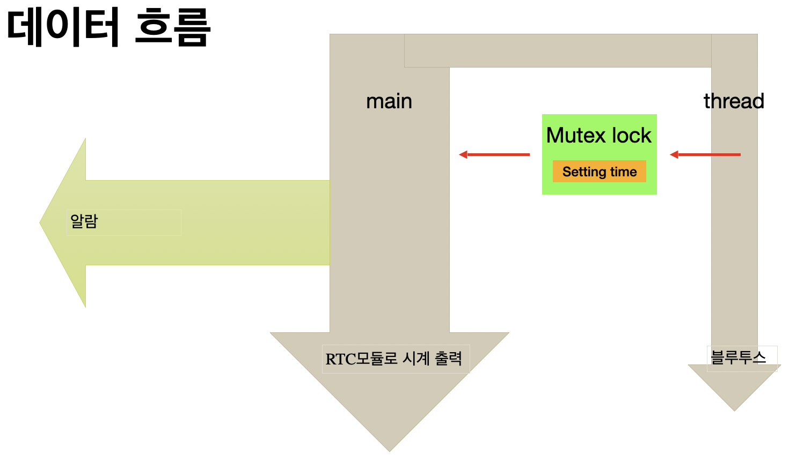

# Embedded system TermProject
## 센서를 활용한 알람 시계 제작

금오공과대학교 컴퓨터공학과 
임베디드시스템 1분반 - 5팀 
신상호 20180630 
이인재 20180894 
이재형 20180904 
이정우 20190893 

## 목차
1. 프로젝트 개요
2. 1차 구현
3. 최종 구현

### 1. 프로젝트 개요
조도 센서와 RTC 모듈을 이용한 알람 시계 구현

기능 목록
- 조도 센서와 RTC 모듈을 사용하여 알람 타이밍 결정
- 패시브 스피커를 통해 알람 출력
- FND 상의 숫자를 넘버 패드로 입력하면 알람 종료
- 서보 모터를 사용하여 전등 스위치를 물리적으로 제어
- DC 모터를 이용하여 커튼 걷기

사용 센서 or 액추에이터 목록
- PWM : 패시브 스피커, DC 모터, 서보 모터
- I2C : RTC, 조도 센서, 숫자 키 패드
- GPIO : FND

프로그램 흐름
main 함수 실행 후, 조도 센서와 RTC 모듈의 동작을 백그라운드 프로세스로 실행시킨다.
이후, 이 백그라운드 프로세스들은 메인 프로세스와 IPC로 데이터를 주고받으며 알람 시간 설정 및 알람 시작을 결정한다.
알람이 울리기 시작하면, 각 모듈의 동작들을 쓰레드를 통해 동시다발적으로 실행한다.

### 2. 1차 구현
설계 변경 사항
- 숫자 키 패드 및 스피커의 구동 방식 변경 - GPIO를 통한 구동
- PWM모듈 간 충돌 발생. 우선순위에서 밀리는 모듈 제거 - DC 모터
- 사용 목적이 불분명한 센서 제거 - 조도 센서
- 교수님의 피드백을 받아 통신 모듈 추가 - 블루투스 모듈

1차 구현 시 사용한 모듈
- PWM : 서보 모터
- I2C : RTC
- GPIO : FND, 패시브 스피커, 숫자 키 패드(기능 구현 X)
- UART : 블루투스

프로그램 흐름 변경
백그라운드 프로세스 -> 전부 쓰레드로 대체
블루투스 쓰레드에서 알람 시간 설정
mutex의 lock을 이용하여 알람 시간 설정 시 임계구역 문제 방지
메인 쓰레드에서 설정한 시간이 되면 알람 구동

데모 영상

### 3. 최종 구현
설계 변경 사항
- FND 제외(독립적인 동작은 되나 병합 시 I2C버스 오류 발생)
- 숫자 키 패드 기능 구현

프로그램 흐름도
각 모듈마다 하나의 쓰레드 할당. 
메인 쓰레드는 쓰레드 컨트롤만 담당.
